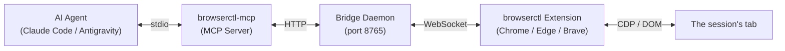

# browserctl

Browser automation for AI agents and developers, driving your real Chrome profile in the background.

[](https://www.npmjs.com/package/browserctl-mcp)
[](LICENSE)
[](https://nodejs.org)

Control the browser you already use from Claude Code, Antigravity, Cursor, or any MCP client.
browserctl pairs a local bridge daemon with a Chrome MV3 extension: the agent works in your real
profile, with your logins and cookies, and reads each page as a compact text census of its controls
instead of a screenshot or a full accessibility tree.

---

## Why browserctl?

- **Your real session.** The agent works in the browser profile you are signed into: logins, 2FA,
  cookies and extensions are already there. No fresh browser, no re-authentication.
- **No relaunch.** Load the extension once. Chrome does not need to be restarted with
  `--remote-debugging-port`, and no separate browser binary is downloaded.
- **A small tool surface.** A core set of tools is visible at connect; network, cookies, storage,
  console, raw CDP and the rest load on demand and unload when done, so the agent's context stays
  small.
- **Targeting that does not guess.** A target is a ref, a CSS selector, visible text or an index,
  resolved in a fixed order. Two matches is an error listing the candidates, and a stale ref is
  refused rather than re-pointed at whatever replaced it.
- **Every action reports what happened.** Each click or type returns `resolved` (which element it
  hit, and how it was matched) and `effect` (whether the page changed), so the agent can confirm a
  step without taking a screenshot.

What `browser_snapshot` hands the agent for a page (iana.org, trimmed):

```text
[Header / Banner]
  [@ref_1] <a> "Domains" -> /domains
  [@ref_2] <a> "Protocols" -> /protocols
  ...
structure: footer 22 (@ref_32), header 5 (@ref_33), main 4 (@ref_34)
```

---

## Architecture

Your agent talks to the MCP server over stdio. The MCP server talks to a local bridge daemon
(port `8765`), and the bridge drives the browser through the extension.



---

## Quickstart

### 1. Add the MCP server

For **Claude Code**:

```bash
claude mcp add browserctl -s user -- npx -y -p browserctl-mcp browserctl-mcp
```

Most other clients take the same entry; only the file it goes in differs:

```json
{
  "mcpServers": {
    "browserctl": {
      "command": "npx",
      "args": ["-y", "-p", "browserctl-mcp", "browserctl-mcp"]
    }
  }
}
```

<details>
<summary>Cursor</summary>

Add the entry above to `~/.cursor/mcp.json` (every project) or `.cursor/mcp.json` (one project).

</details>

<details>
<summary>VS Code (Copilot)</summary>

VS Code uses a `servers` key and a `type`. In `.vscode/mcp.json`, or via
**MCP: Open User Configuration** for every workspace:

```json
{
  "servers": {
    "browserctl": {
      "type": "stdio",
      "command": "npx",
      "args": ["-y", "-p", "browserctl-mcp", "browserctl-mcp"]
    }
  }
}
```

</details>

<details>
<summary>Devin Desktop (formerly Windsurf)</summary>

```bash
devin mcp add -s user browserctl -- npx -y -p browserctl-mcp browserctl-mcp
```

</details>

<details>
<summary>Codex</summary>

```bash
codex mcp add browserctl -- npx -y -p browserctl-mcp browserctl-mcp
```

Or in `~/.codex/config.toml`:

```toml
[mcp_servers.browserctl]
command = "npx"
args = ["-y", "-p", "browserctl-mcp", "browserctl-mcp"]
```

</details>

<details>
<summary>Gemini CLI</summary>

```bash
gemini mcp add -s user browserctl npx -- -y -p browserctl-mcp browserctl-mcp
```

Or add the entry above to `~/.gemini/settings.json` (user) or `.gemini/settings.json` (project).

</details>

<details>
<summary>Claude Desktop</summary>

Settings > Developer > Edit Config opens `claude_desktop_config.json`. Add the entry above and
restart Claude Desktop.

- macOS: `~/Library/Application Support/Claude/claude_desktop_config.json`
- Windows: `%APPDATA%\Claude\claude_desktop_config.json`

</details>

<details>
<summary>opencode</summary>

opencode uses an `mcp` key and a command array. In `~/.config/opencode/opencode.json` or
`opencode.json` in a project:

```json
{
  "$schema": "https://opencode.ai/config.json",
  "mcp": {
    "browserctl": {
      "type": "local",
      "command": ["npx", "-y", "-p", "browserctl-mcp", "browserctl-mcp"],
      "enabled": true
    }
  }
}
```

`opencode mcp list` should show browserctl as connected.

</details>

<details>
<summary>pi</summary>

pi 0.99 and later:

```bash
pi mcp add browserctl -- npx -y -p browserctl-mcp browserctl-mcp
```

This writes `~/.pi/agent/mcp.json`; `-l` writes `.pi/mcp.json` in the project instead. Check with
`pi mcp list`, and run `/reload` in a session that is already open.

</details>

<details>
<summary>Antigravity</summary>

Antigravity 2.0, Antigravity IDE and the Antigravity CLI (`agy`) share one config file, so one
setup covers all three. From a terminal:

```bash
agy mcp add browserctl -- npx -y -p browserctl-mcp browserctl-mcp
```

This writes `~/.gemini/config/mcp_config.json` (`%USERPROFILE%\.gemini\config\mcp_config.json`
on Windows). Without the CLI, add the entry above to that file by hand. Check with
`agy mcp list`, and refresh the MCP servers in an app that is already open. For one project
only, add the entry to `.agents/mcp_config.json` in that project instead.

</details>

**On Windows**, `npx` is a `.cmd` shim, and a client that starts the server without a shell fails
with `ENOENT` or "Connection closed". Claude Code and opencode handle this themselves. For another
client, wrap the command: `"command": "cmd", "args": ["/c", "npx", "-y", "-p", "browserctl-mcp", "browserctl-mcp"]`.

### 2. Load the extension

1. Copy the extension to a fixed folder and print its path:
   ```bash
   npx -y -p browserctl-mcp browserctl extension-path --copy
   ```
2. Open `chrome://extensions` (`edge://extensions` in Edge, `brave://extensions` in Brave) and turn
   on **Developer mode**.
3. Click **Load unpacked** and select the folder printed above (`~/.browserctl/extension`).
4. Click the browserctl toolbar icon and press **Connect**.

### 3. Ask your agent

> "Open https://github.com/trending and summarize the top repository."

For a global npm install, running from source, or daemon configuration, see
[docs/INSTALL.md](docs/INSTALL.md).

---

## What an agent session looks like

Real calls, each result cut to one line:

```text
User:   What does example.com link to?
Agent:  browser_navigate({ url: "https://example.com" })
Agent:  browser_snapshot({})               -> [@ref_1] <a> "Learn more" -> https://iana.org/help/example-domains
Agent:  browser_click({ target: "@ref_1" }) -> resolved: by ref, <a> "Learn more", 1 match
Agent:  browser_snapshot({})               -> https://www.iana.org/help/example-domains, "Example Domains"
Agent:  It links to IANA's "Example Domains" page, which explains these domains are reserved for documentation.
```

---

## Tools and the interaction loop

| Stage | Representative tools | Purpose |
|---|---|---|
| **1. Navigate** | `browser_navigate`, `browser_tabs` | Open a URL or reload; list, open, select or release tabs |
| **2. Read** | `browser_snapshot`, `browser_read_page`, `browser_find`, `browser_get_content` | List the page's controls with `@ref_N` refs, read the accessibility tree, find an element, read article text |
| **3. Act** | `browser_click`, `browser_type`, `browser_fill_form`, `browser_press_key` | Click, type, fill several fields at once, send keys |
| **4. Verify** | `browser_wait_for`, `browser_take_screenshot`, `browser_status` | Wait for an element or text, capture the page, check the bridge and extension |

The core tools, visible at connect:

- **Daemon and session:** `browser_status`, `browser_start`, `browser_stop`.
- **Navigation and tabs:** `browser_navigate`, `browser_tabs`.
- **Reading:** `browser_snapshot`, `browser_read_page`, `browser_find`, `browser_extract`,
  `browser_get_content`, `browser_get_property`.
- **Acting:** `browser_click`, `browser_type`, `browser_fill_form`, `browser_select_option`,
  `browser_press_key`, `browser_scroll`, `browser_hover`, `browser_file_upload`.
- **Waiting and utilities:** `browser_wait_for`, `browser_take_screenshot`, `browser_evaluate`,
  `browser_action`.
- **Loading more tools:** `browser_load_tools`, `browser_list_available_tools`.

More tools load on demand with `browser_load_tools({ profile: "..." })`: `network`, `cookies`,
`storage`, `console`, `cdp`, `record`, `tabs`, `advanced` and `system`.
[docs/TOOLS.md](docs/TOOLS.md) lists every tool in every profile.

---

## Several agents, one browser

Each agent session gets a tab of its own. Another agent, or a `bctl` command, cannot act on that tab
or close it, and clicking around in another window does not change where the agent's next command
goes. Several browsers and profiles can be connected to one bridge at once; a session picks which
tab it works in.

---

## Configuration

Set these in the MCP entry's `env` block (opencode: `environment`) and, for the CLI, in your
shell. Every variable is optional.

| Variable | Default | Meaning |
|---|---|---|
| `BROWSERCTL_MCP_PROFILE` | `core` | `core` shows the core tools and loads the rest on demand; `all` shows every tool at connect. |
| `BROWSERCTL_BRIDGE_URL` | `http://127.0.0.1:8765` | Where to reach the bridge. A bridge started automatically listens on this URL's port. |
| `BROWSERCTL_AUTO_START` | `auto` | `manual` never starts the bridge; run `browserctl start` yourself. |
| `HOST` | `0.0.0.0` | Interface the bridge listens on. `127.0.0.1` keeps it local-only. |

The rest are in [docs/INSTALL.md](docs/INSTALL.md#environment-variables).

---

## Troubleshooting

- **`Extension: DISCONNECTED`**: click the extension icon and press **Connect**. If it still
  fails, check that the port in the extension's settings (icon > Open settings) matches
  `BROWSERCTL_BRIDGE_URL`.
- **The client says the server failed to start, or `command not found`**: GUI clients often do not
  see your shell's PATH, especially with nvm, fnm or volta. Use the full path to `npx` as the
  command (`which npx` on macOS/Linux, `where npx` on Windows).
- **Windows: `ENOENT` or `Connection closed` right after start**: wrap the command in `cmd /c`
  (see the end of [Quickstart step 1](#1-add-the-mcp-server)).
- **Port 8765 is already in use**: set `BROWSERCTL_BRIDGE_URL=http://127.0.0.1:8766` in the MCP
  entry, set the same port in the extension's settings, and press **Save & reconnect**.
- **`NEEDS_TARGET`**: several browsers are connected and the session has no tab yet. The error
  lists every open tab; tell the agent which one you mean.
- **`TAB_OWNED`**: the tab belongs to another agent session. Let the agent open a tab of its own.
- **A tool you expect is missing**: it is in a profile that is not loaded. Ask the agent to load it
  (`browser_load_tools`), or set `BROWSERCTL_MCP_PROFILE=all`.

Every error code and its fix: [docs/INSTALL.md](docs/INSTALL.md#troubleshooting).

---

## Security and privacy

- **The extension talks to one place only:** the local bridge address you configure (default
  `127.0.0.1:8765`). It acts only on commands that arrive from that bridge.
- **The bridge listens on all interfaces by default** (`HOST=0.0.0.0`). To keep it local-only, set
  `HOST=127.0.0.1` in the environment that starts it; see [docs/INSTALL.md](docs/INSTALL.md).
- **No analytics.** Nothing is sent to any other server.
- **Broad permissions, readable source.** The extension asks for access to all sites and for
  `debugger`, because driving any page is its job. Its full source ships in the package
  (`extension/`), so you can read exactly what you load.

---

## Documentation

- [docs/INSTALL.md](docs/INSTALL.md) — installation, loading the extension, daemon configuration.
- [docs/REFERENCE.md](docs/REFERENCE.md) — parameters of the core tools and the target resolution rules.
- [docs/TOOLS.md](docs/TOOLS.md) — generated catalogue of every tool in every profile.
- [CHANGELOG.md](https://github.com/nguyenvanhuy0612/browserctl/blob/main/CHANGELOG.md) — release history; each version also has a
  [GitHub release](https://github.com/nguyenvanhuy0612/browserctl/releases).
- [CONTRIBUTING.md](https://github.com/nguyenvanhuy0612/browserctl/blob/main/CONTRIBUTING.md) — how the project is built and the release gates.
